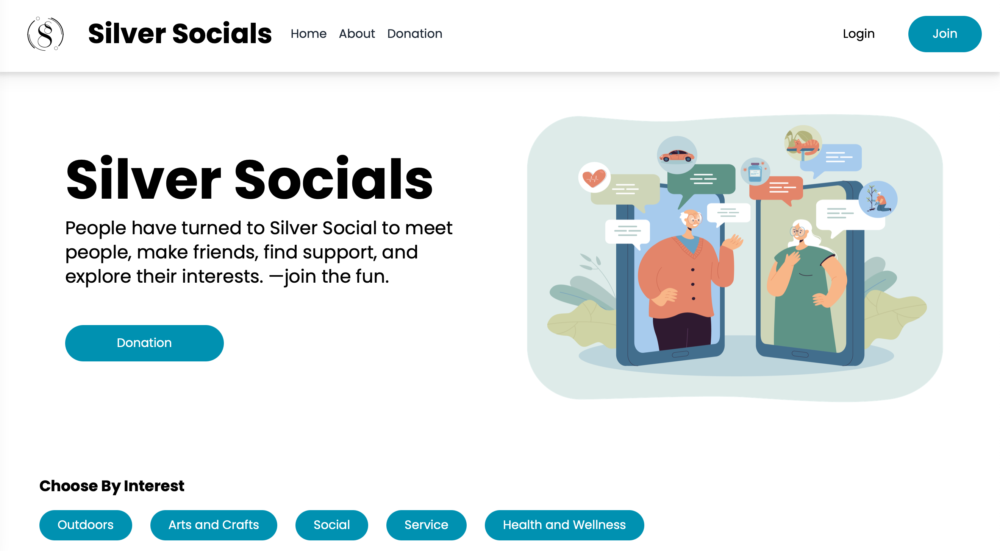

  # Silver Socials

  

  # Table of Contents
  * [Project Description](#description)
  * [Installation](#installation)
  * [Usage](#usage)
  * [Licensing](#license)
  * [Questions](#questions)
  
  
  ## Description
  A MERN-Stack social network app for people 55+ to socialize. Uses GraphQl to query the server, JWT Authentication, Faker.js, Stripe, and SASS, Material UI, Tailwind CSS, Figma, and Heroicon for the UX Design.

  Deployed: **UPDATE: in the midst of redploying due to 1) the beginning of heroku subscriptions and 2) trying to migrate to NextJS.

  
  ## Installation
  Clone the repo. Run 'npm i' in the root of the project.

  
  ## Usage
  Users can sign up, join groups, create groups, and post in those groups when joined. Users can also filter for groups by interests. Users can make donations to the app development using Stripe. Users can also run the app locally after installation using 'npm run develop' to run concurrent servers.

  Here is how the app looks: 
  

  
  ## Licensing
  This app is licensed under MIT. For more information, click on the badge link above.

  
  ## Questions
  You can find more of the original contributors' work at [rheam97](https://github.com/rheam97), [rdenton3](https://github.com/rdenton3), [Maryjezek](https://github.com/Maryjezek), and [NFoithong](https://github.com/NFoithong) on GitHub and contact me with any questions
  at rheam97@gmail.com.

